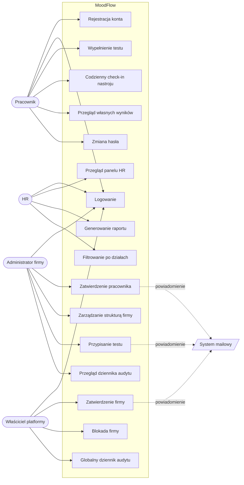

# Diagram przypadków użycia — MoodFlow

Diagram pokazuje główne interakcje aktorów z systemem MoodFlow.

## Aktorzy

- **Pracownik (EMPLOYEE)** — końcowy użytkownik wypełniający testy.
- **HR** — pracownik działu HR z dostępem do zagregowanych raportów.
- **Administrator firmy (ADMIN)** — zarządza użytkownikami i strukturą organizacji.
- **Właściciel platformy (SUPER_ADMIN)** — operator platformy MoodFlow, zatwierdza nowe firmy.
- **System mailowy** — aktor zewnętrzny obsługujący powiadomienia e-mail.

## Diagram

## Opis kluczowych przypadków użycia

### UC3 — Wypełnienie testu

- **Aktor główny:** Pracownik
- **Warunki wstępne:** użytkownik zalogowany, status `ACTIVE`, ma przypisany aktywny test (assignment z `availableTo > now()`).
- **Przebieg:**
  1. Pracownik wybiera test z listy „Do wykonania".
  2. System pobiera definicję testu z odpowiedziami.
  3. Pracownik odpowiada na pytania.
  4. System waliduje kompletność.
  5. System oblicza wynik (raw + normalizowany + severity) po stronie backendu.
  6. System zapisuje `AssessmentResult`, aktualizuje agregaty.
- **Warunki końcowe:** wynik dostępny w widoku „Wyniki", indeks dobrostanu zaktualizowany.

### UC22 — Przypisanie testu

- **Aktor główny:** Administrator firmy lub HR
- **Warunki wstępne:** zalogowany, organizacja `ACTIVE`.
- **Przebieg:**
  1. Wybór testu z katalogu (PHQ-9, GAD-7, PSS-10, WHO-5, MOOD10).
  2. Wybór celu: ALL / DEPARTMENT / USER.
  3. Wybór terminu (`durationHours`).
  4. System tworzy `AssessmentAssignment`.
  5. System asynchronicznie wysyła powiadomienia e-mail tylko do użytkowników o roli `EMPLOYEE`.
  6. System loguje akcję w `audit_logs` (akcja `ASSIGNMENT_CREATED`).

### UC30 — Zatwierdzenie firmy

- **Aktor główny:** Właściciel platformy
- **Warunki wstępne:** istnieje organizacja w statusie `PENDING`.
- **Przebieg:**
  1. Przegląd zgłoszeń.
  2. Weryfikacja danych (nazwa, NIP, opis).
  3. Akceptacja → status org `ACTIVE`, status admina `ACTIVE`.
  4. Audit log `ORGANIZATION_APPROVED`.
