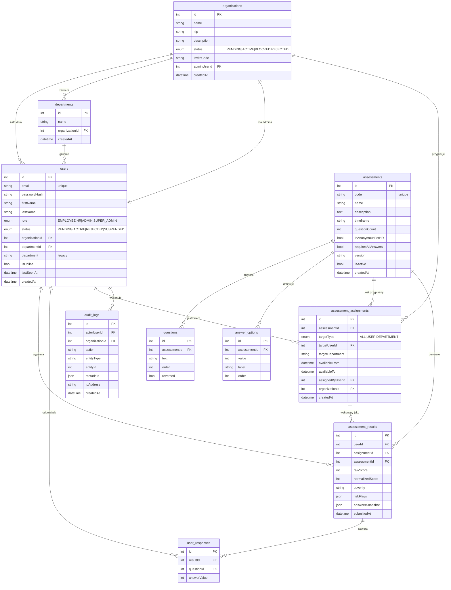

# Diagram ERD bazy danych — MoodFlow

Schemat relacyjny bazy PostgreSQL. Tabele są normalizowane (3NF), kluczowe relacje
wyposażone w indeksy.

## Diagram

## Decyzje projektowe

| Decyzja | Uzasadnienie |
|---|---|
| Encja `audit_logs` z `metadata` typu `jsonb` | Elastyczny schemat dla różnych typów akcji (USER_APPROVED, ORGANIZATION_REJECTED itd.). Indeksy złożone na `(actorUserId, createdAt)` i `(organizationId, createdAt)`. |
| `answersSnapshot` w `assessment_results` jako `json` | Trwały zapis pełnych odpowiedzi w momencie zapisu wyniku — zabezpieczenie przed zmianami w katalogu testów po wypełnieniu. |
| `organizationId` na każdej encji domenowej | Multi-tenant izolacja — każde zapytanie filtruje po `organizationId` z JWT. |
| Enum'y `status` zamiast bool'ów | Czytelne stany w pracy inżynierskiej i diagramach maszyn stanów. |
| `severity` jako `varchar` (nie enum) | Różne testy mają różne skale (PHQ-9: minimal/mild/moderate/moderately-severe/severe; WHO-5: low/moderate/high), trudno o wspólny enum. |
| Twardy delete użytkownika (`DELETE`) | Zgodnie z RODO — pełne usuwanie konta. Audit log zachowuje historię operacji. |
