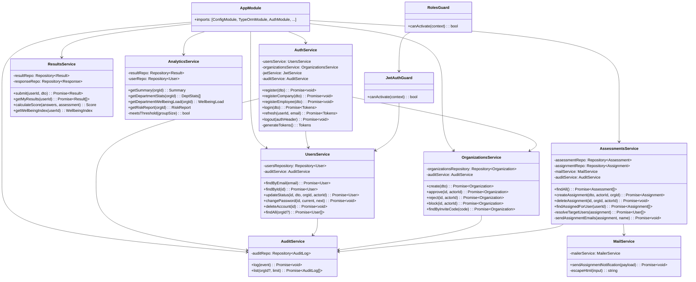

# Diagram klas — moduły backendu MoodFlow

Diagram pokazuje główne klasy modułów NestJS i ich zależności (dependency injection).

## Diagram

## Wzorce architektoniczne

- **Dependency Injection** — wszystkie zależności przez konstruktor (NestJS IoC container).
- **Repository Pattern** — TypeORM `Repository<Entity>` dla każdego agregatu.
- **Guard Pattern** — `JwtAuthGuard` (autentykacja) + `RolesGuard` (autoryzacja) jako warstwa pre-handler.
- **DTO + ValidationPipe** — globalna walidacja wejścia (whitelist + forbidNonWhitelisted).
- **Audit Log Service** — wstrzykiwany do innych serwisów, niezależny od kontekstu HTTP (wartość `actorUserId` przekazywana z kontrolera).
