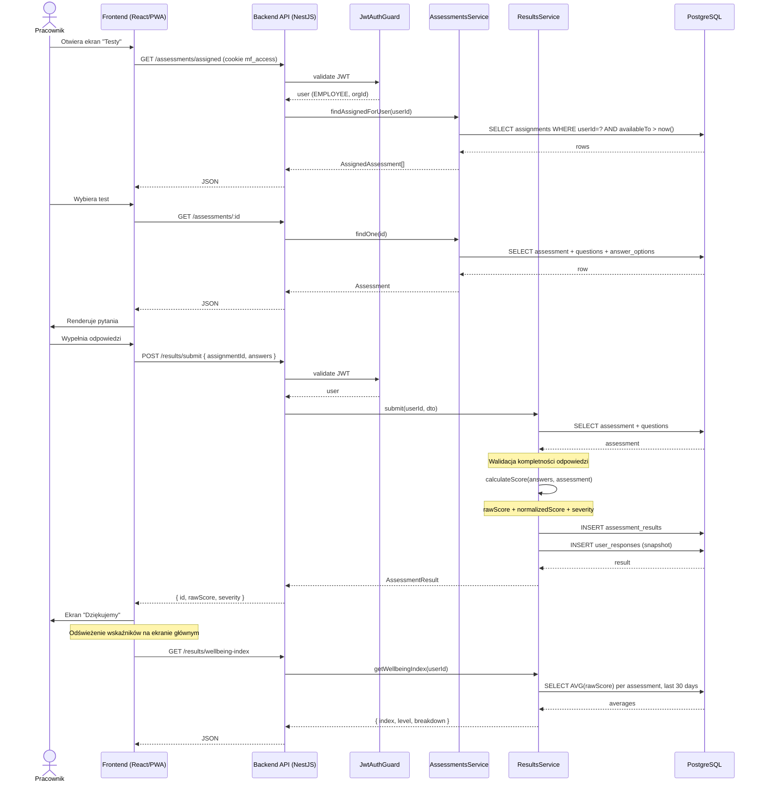

# Diagram sekwencji — wypełnienie testu

Pokazuje przepływ danych przy wypełnianiu testu przez pracownika, od pobrania
treści testu po zapisanie wyniku i odświeżenie indeksu dobrostanu.

## Diagram

## Decyzje techniczne

| Krok | Decyzja | Uzasadnienie |
|---|---|---|
| Walidacja JWT | Cookie `mf_access` (httpOnly) ma priorytet, fallback `Authorization: Bearer` | Mitygacja XSS — token niedostępny z `document.cookie`. |
| Obliczanie scoringu | Backend, nie frontend | Wymóg z RULES.md pkt 6 — logika domenowa po stronie backendu. |
| `answersSnapshot` | Zapis pełnych odpowiedzi w `assessment_results.answersSnapshot` (JSON) | Niezmienność danych historycznych nawet po zmianie definicji testu. |
| Wellbeing index | Wagi konfigurowane w kodzie (`WB_CONFIG`) | Obliczany z 5 testów (WHO-5 + PSS-10 + PHQ-9 + GAD-7 + MOOD10), wagi 30/20/20/15/15%. |
