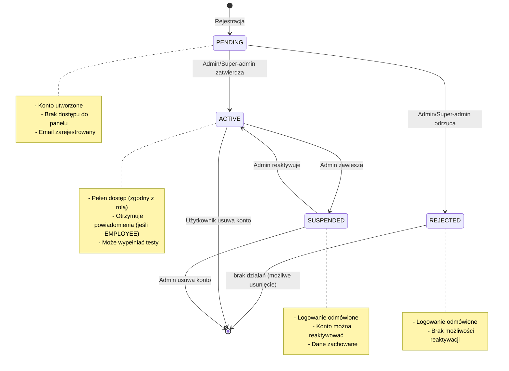
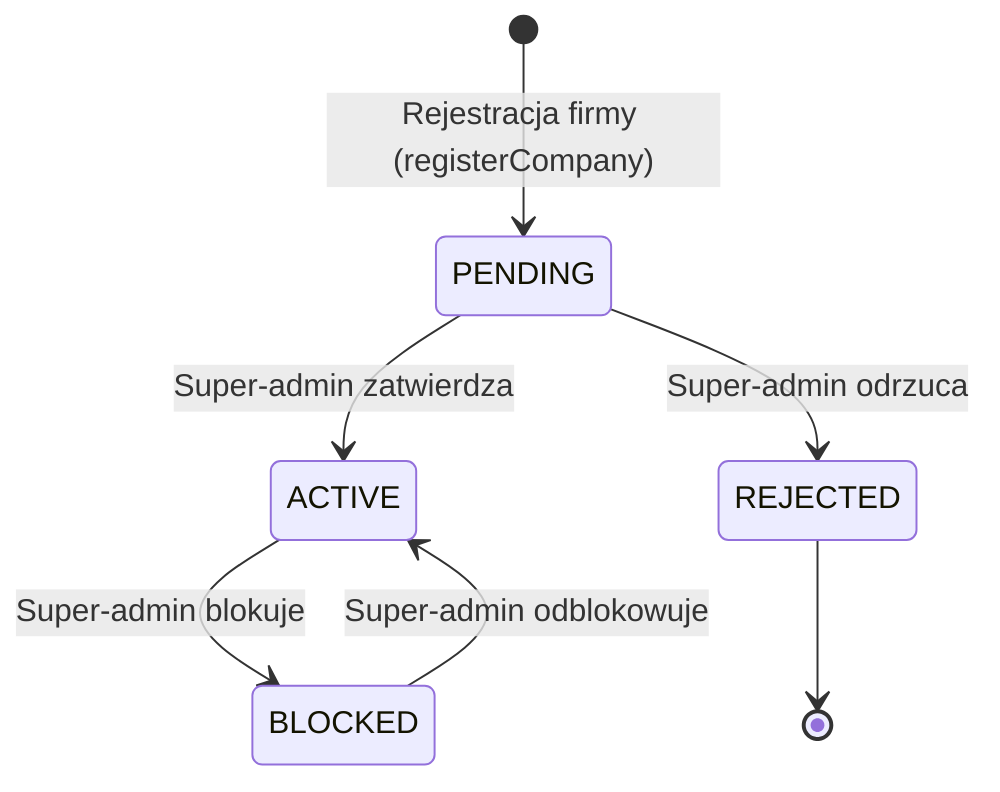

# Diagram maszyny stanów — cykl życia konta użytkownika

Diagram pokazuje stany konta użytkownika i przejścia między nimi.
Statusy są przechowywane w `users.status` (enum).

## Diagram

## Tabela przejść

| Stan początkowy | Stan końcowy | Akcja | Aktor | Audit log |
|---|---|---|---|---|
| (brak) | PENDING | rejestracja | Pracownik / Admin firmy | (nie logowany) |
| PENDING | ACTIVE | zatwierdzenie | ADMIN / SUPER_ADMIN | `USER_APPROVED` |
| PENDING | REJECTED | odrzucenie | ADMIN / SUPER_ADMIN | `USER_REJECTED` |
| ACTIVE | SUSPENDED | zawieszenie | ADMIN / SUPER_ADMIN | `USER_SUSPENDED` |
| SUSPENDED | ACTIVE | reaktywacja | ADMIN / SUSPER_ADMIN | `USER_REACTIVATED` |
| ACTIVE / SUSPENDED | (usunięty) | self-delete lub admin delete | sam użytkownik / ADMIN | `ACCOUNT_DELETED` |

## Diagram cyklu organizacji

