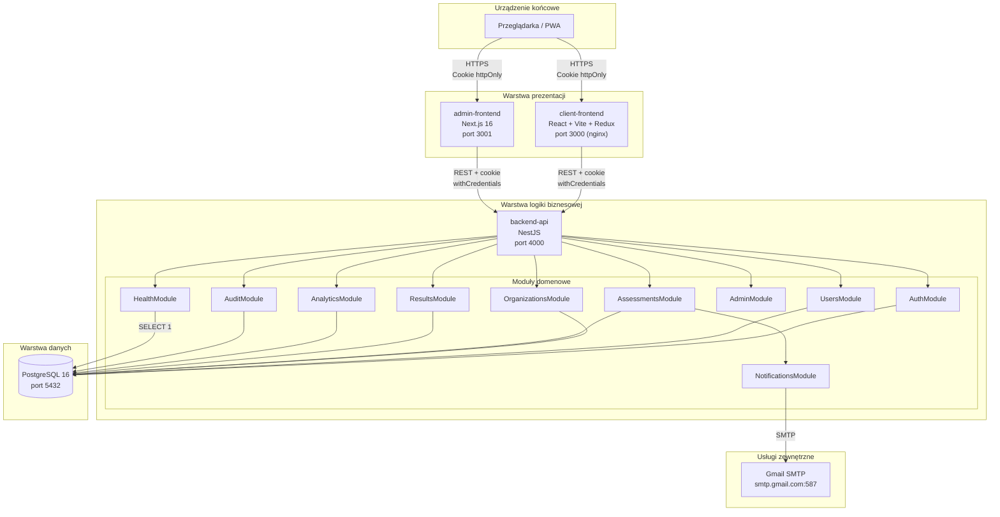

# Diagram komponentów — architektura systemu MoodFlow

Pokazuje główne komponenty aplikacji i ich kanały komunikacji.

## Diagram

## Komunikacja i protokoły

| Połączenie | Protokół | Format | Bezpieczeństwo |
|---|---|---|---|
| Browser ↔ Frontend | HTTPS | HTML/JS/CSS | TLS 1.2+, CSP via Helmet, SW (PWA) |
| Frontend ↔ Backend | HTTPS REST | JSON | JWT w httpOnly cookie + Bearer fallback |
| Backend ↔ DB | TCP | binary (pg) | Wymagany VPC private network w prod |
| Backend ↔ SMTP | TCP+TLS | SMTP | TLS 1.2+, App Password (nie hasło konta) |

## Wzorce architektoniczne

- **Modular monolith** — backend jako jeden proces NestJS z modułami domenowymi.
- **Layered architecture** — controllers → services → repositories.
- **API Gateway pattern** (uproszczona forma) — frontendy przez własny URL, jeden punkt dostępu API.
- **Multi-tenant** — izolacja danych przez `organizationId` filtrowane na każdym zapytaniu.
