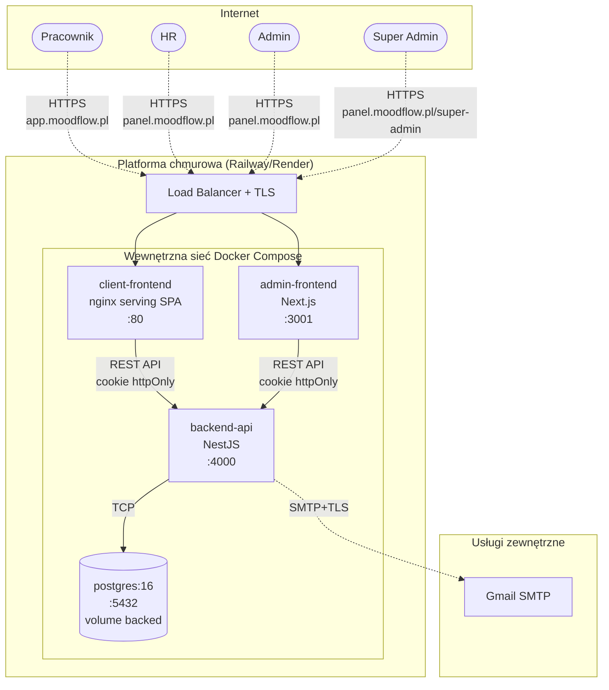

# Diagram wdrożenia — środowisko produkcyjne MoodFlow

Wdrożenie na platformie chmurowej (Railway / Render / Fly.io). Wszystkie kontenery
w jednej sieci wewnętrznej, dostęp publiczny tylko do frontendów.

## Diagram



## Konfiguracja produkcyjna

| Element | Wartość | Uwagi |
|---|---|---|
| Orkiestracja | `docker compose -f docker-compose.prod.yml up -d` | Healthchecki dla wszystkich serwisów |
| Restart policy | `unless-stopped` | Automatyczny restart przy crash |
| TLS | terminowane na load balancerze | Railway/Render dostarczają domyślnie |
| Postgres ports | tylko `expose` (nie `publish`) | Brak publicznego dostępu do bazy |
| Adminer | NIEOBECNY w prod compose | Tylko dev tool |
| Sekrety | przez env vars platformy | Nie w repo, nie w obrazie |
| Synchronize TypeORM | `false` | Migracje przez `migrationsRun: true` |
| Backup DB | po stronie platformy (managed Postgres) | Snapshot dzienny |

## Wymagane zmienne środowiskowe (produkcja)

```bash
# Baza
DB_HOST=<managed-postgres-host>
DB_PORT=5432
DB_USER=moodflow
DB_PASSWORD=<silne-haslo-wygenerowane>
DB_NAME=moodflow

# JWT (różne, min. 64 bajty losowe)
JWT_SECRET=<base64-64bytes>
JWT_REFRESH_SECRET=<base64-64bytes>

# CORS — domena frontendu
CORS_ORIGIN=https://app.moodflow.pl,https://panel.moodflow.pl

# Frontend → Backend URL
NEXT_PUBLIC_API_URL=https://api.moodflow.pl
NEXT_PUBLIC_CLIENT_URL=https://app.moodflow.pl
VITE_API_URL=https://api.moodflow.pl
VITE_ADMIN_URL=https://panel.moodflow.pl

# SMTP
MAIL_HOST=smtp.gmail.com
MAIL_PORT=587
MAIL_USER=moodflow.biuro@gmail.com
MAIL_PASS=<gmail-app-password>
MAIL_FROM=MoodFlow <moodflow.biuro@gmail.com>
```
