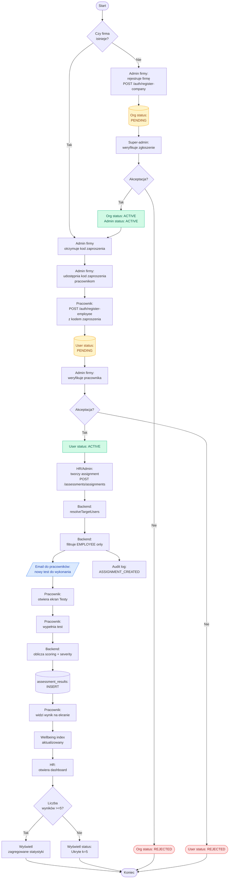

# BPMN — proces rejestracji firmy i pierwszego testu

Diagram pokazuje pełen proces biznesowy od rejestracji firmy po pierwsze
wypełnienie testu przez pracownika.

## Diagram

## Role w procesie i ich odpowiedzialności

| Rola | Odpowiedzialność | Stany w procesie |
|---|---|---|
| Super-admin | Zatwierdza rejestracje firm | B3, B4 |
| Admin firmy | Rejestruje firmę, zatwierdza pracowników, tworzy assignments | B1, E3, E4, F1 |
| HR | Tworzy assignments, analizuje raporty | F1, H1 |
| Pracownik | Rejestruje się, wypełnia testy | E1, G1, G2 |
| System | Walidacja, scoring, audyt, mailing | wszędzie automatycznie |

## Punkty decyzyjne

1. **B4 — Akceptacja firmy**: super-admin sprawdza czy NIP jest poprawny, czy nazwa firmy istnieje w KRS, czy nie ma duplikatów.
2. **E4 — Akceptacja pracownika**: admin firmy weryfikuje czy email należy do pracownika (z listy zatrudnionych), czy nie ma duplikatów.
3. **H2 — Próg anonimizacji**: minimum 5 osób w grupie aby HR widział agregaty (k-anonymity zgodnie z RULES.md pkt 12).

## Logowanie audytu (audit_logs)

| Akcja | Akcja w audit_logs | Aktor |
|---|---|---|
| Akceptacja firmy | `ORGANIZATION_APPROVED` | Super-admin |
| Odrzucenie firmy | `ORGANIZATION_REJECTED` | Super-admin |
| Akceptacja pracownika | `USER_APPROVED` | Admin firmy |
| Odrzucenie pracownika | `USER_REJECTED` | Admin firmy |
| Stworzenie assignmentu | `ASSIGNMENT_CREATED` | HR / Admin firmy |
| Logowanie | `LOGIN_SUCCESS` / `LOGIN_FAILED` | każdy |
